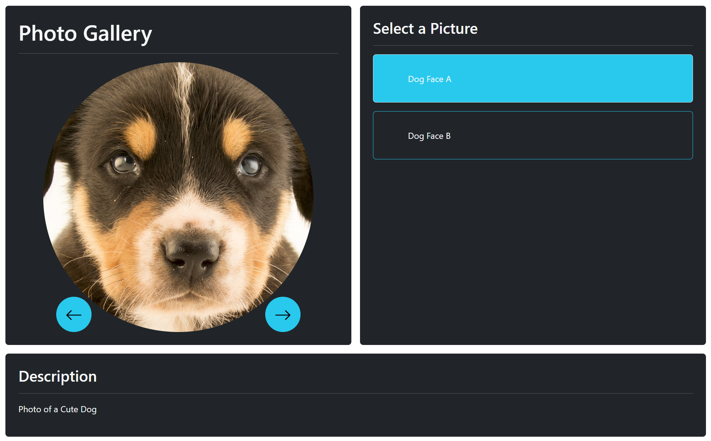

# TP - Photo Gallery

### Objectif
Comprendre et utiliser le Typescript dans le cadre d'un projet d'application web se servant de l'HTML et du CSS dans le but de fournir l'interface


### Sujet
Via l'utilisation de vos connaissances en algorithmie et en logique Javascript / Typescript, vous réaliserez une application permettant de voir une gallerie d'images. L'objectif sera de fournir une interface semblable à celle montrée dans l'exemple ci-dessous. Cette interface disposera de plusieurs boutons.

- En dessous de l'image, vous aurez la possibilité d'utiliser un bouton **précédent** et un bouton **suivant** dans le but de naviguer rapidement d'une photo à l'autre.
- Dans une section à droite du visionnage de l'image, vous aurez la capacité de choisir directement une image à partir du titre de celle-ci. 
- L'image sélectionnée sera visible à gauche tandis que son titre sera mit en évidence dans la section de sélection directe d'une image.
- Une section en bas de l'application vous permettra d'afficher les détails de l'image, comme par exemple un texte de description, les crédits d'un artiste, etc...

Pour vous aider, vous pouvez utiliser une classe du type :

```ts
class ImageItem {
  private static _count: number = 0;
  private _id: number;

  constructor(private imageUrl: string, private imageTitle: string, private imageDescription: string) {
    this._id = ++ImageItem._count;
  }
}
```

ou une interface telle que :
```ts
interface ImageItem {
  id: number;
  imageUrl: string;
  imageTitle: string;
  imageDescription?: string;
}
```

Il est également conseillé de recourir du coup à deux variables dans votre script, telles que :
```ts
const images: ImageItem[];
let selectedImage: ImageItem;
```

---

