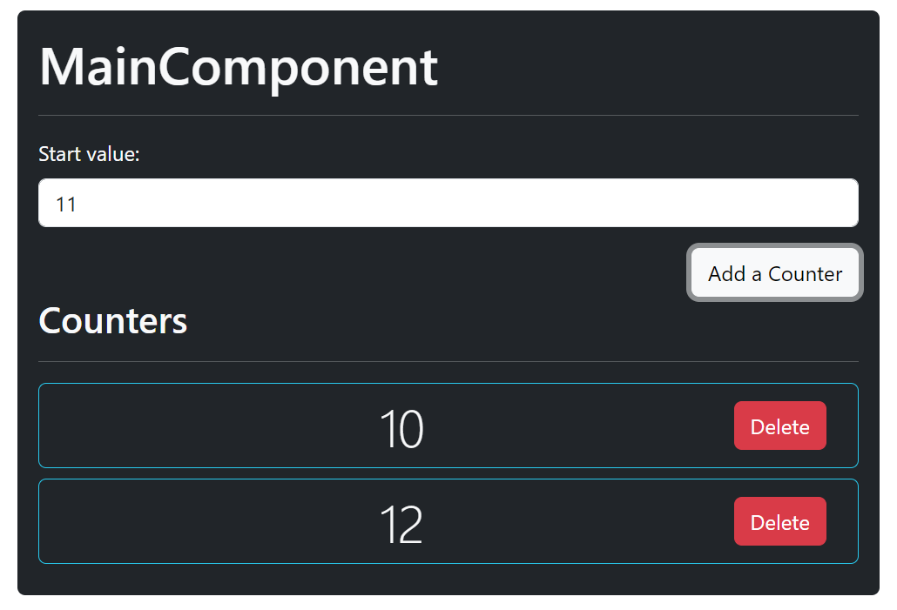

# Exercice Compteur 
### Objectif
Appréhender l'utilisation des hooks avec React pour créer une application optimisant les performances du client

### Sujet
Réaliser une application React permettant à une utilisateur de pouvoir avoir un ou plusieurs compteurs commençant chacun à une valeur numérique de son choix. Les compteurs devront se servir de `useEffect` pour créer un **interval** Javascript permettant le décompte du temps qui passe. 

Chaque seconde fera augmenter la valeur actuelle des compteurs de un. Lors de l'appui sur un bouton de suppression, le compteur, ainsi que son interval, seront retiré du navigateur de sorte à optimiser la gestion mémoire et éviter des demandes de calcul superflues. 

Pour réaliser cette application, vous aurez donc besoin d'utiliser deux hooks : `useState` ainsi que `useEffect` ainsi que vos connaissance en matière de transmission de paramètres d'un composant parent à un composant enfant via des **props**.

---

