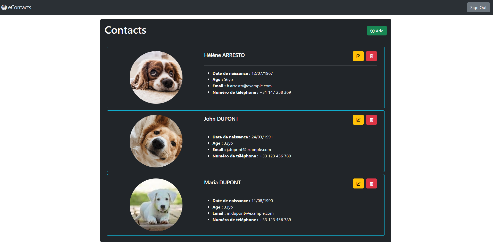

# eContacts en React - Avec Authentication
### Objectifs
Appréhender la persistances des données ainsi que l'authentification dans une application React usant de Firebase comme service distant accessible par requêtes API.

### Sujet
Vous devrez réaliser une application Front-End avec React permettant à un utilisateur de pouvoir consulter un répertoire en ligne. Ce répertoire sera stocké sur une base de données de type **Realtime Database** disponible sur **Firebase**. Cette base de données aura les règles d'accès suivantes:
```json
{
  "rules": {
    ".read": true,
    ".write": "auth != null",
  }
}
```
Votre connexion se fera via un formulaire présenté au moyen d'un modal en overlay sur la page (avec un fond noir semi-transparent). Suite à votre connexion ou à votre enregistrement dans la base de données, vous stockerez dans le **Local Storage** le token de connexion qui sera utilisé par le suite pour les requêtes ayant attrait au CRUD des contacts. La déconnexion provoquera la suppression du token du stockage local du navigateur du client. 

Un contact pourrait être de la sorte: 
```ts
interface Contact {
  id?: string;
  firstname: string;
  lastname: string;
  email: string;
  phoneNumber: string;
  dateOfBirth: string;
  avatarURL: string;
}
```

Idéalement, le formulaire de création / édition / confirmation de la suppression d'un contact sera un seul et unique composant React, dont les props permettrons de l'afficher, de le remplir des informations de contact en cas de besoin, de le rendre **readonly** ou de faire que les champs soient **required** en fonction de la logique métier. Ce formulaire sera également présenté à l'utilisateur au moyen du modal utilisé pour le formulaire d'enregistrement / de connexion. 

Les manipulations de Crud seront les suivantes:
- **Voir les contacts:** Via l'utilisation d'une requête HTTP de type **GET** publique et sans besoin d'authentification
- **Ajouter un contact:** Via l'utilisation d'une requête HTTP de type **POST** privée nécessitant l'usage d'un **token d'authentification**
- **Modifier un contact:** Via l'utilisation d'une requête HTTP de type **PATCH** privée nécessitant l'usage d'un **token d'authentification**
- **Supprimer un contact:** Via l'utilisation d'une requête HTTP de type **DELETE** privée nécessitant l'usage d'un **token d'authentification**

---

