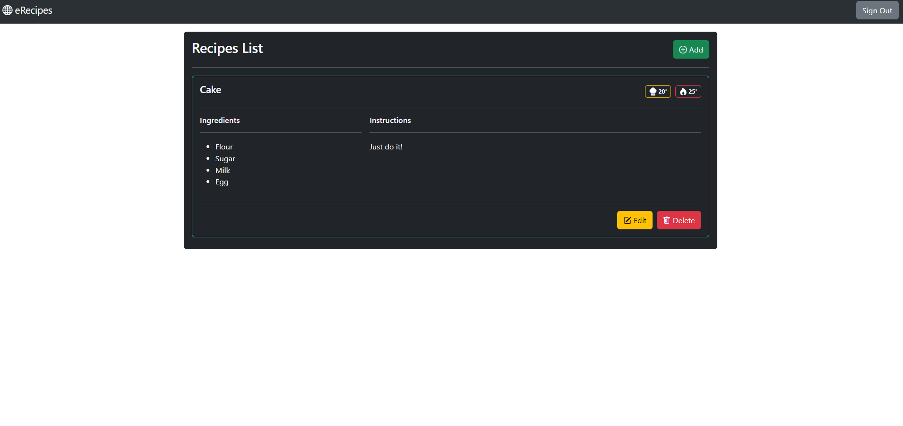

# eRecipes - React Redux
### Objectifs
Appréhender la manipulation de React Redux pour centraliser l'état de notre application

### Sujet
Réalisez une application React se servant de Redux dans le but de centraliser l'état de votre application. 

Cette application aura pour but de permettre le stockage en ligne de recettes de cuisines. Les recettes seront constituées de la sorte:
```ts
interface Recipe {
  id?: string;
  title: string;
  instructions: string;
  cookTime: number;
  prepTime: number;
  ingredients: {id: number, name: string}[];
}
```

Vous devrez faire en sorte que l'application stocke et récupère les recettes depuis **Firebase**. Cette base de donnée disposera d'un système d'authentification basé sur un **email** et un **mot de passe** et les règles de sécurité suivantes:
```json
{
  "rules": {
    ".read": true,
    ".write": "auth != null",
  }
}
```

Votre **CRUD** de recettes se fera donc de la sorte:
- **Ajouter une recette:** Cette option sera **privée** et demandera une requête de type **POST** adjointe d'un token de vérification
- **Voir les recettes:** Cette option sera **publique** et demandera une requête de type **GET** sans token de vérification
- **Modifier une recette:** Cette option sera **privée** et demandera une requête de type **DELETE** adjointe d'un token de vérification
- **Supprimer une recette:** Cette option sera **privée** et demandera une requête de type **PATCH** adjointe d'un token de vérification

Votre application devra centraliser ses données via l'utilisation d'un Store Redux, qui sera composé de deux slices. Les états initiaux de chacune des slices pourront être les suivants: 

`authSlice.js`
```js
initialState: {
    user: null,
    authMode: ""
}
```

`recipesSlice.js`
```js
initialState: {
    formMode: "",
    recipes: [],
    selectedRecipe: null,
    ingredients: [],
    isLoading: false,
    error: null
}
```

Si vous le souhaitez, vous pourrez également alimenter la liste d'ingrédient à partir d'un JSON importé dans votre application au lieu de devoir les récupérer depuis votre base de données. Un ingredient sera constitué de la façon suivante:

```ts
interface Ingredient {
  id: number;
  name: string;
}
```

---

