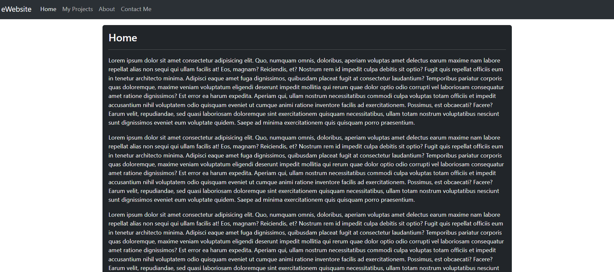

# Routing de base
### Objectif 
Appréhender l'utilisation de React-Router-DOM dans le cadre d'une application de style site portfolio

### Sujet
Réaliser une application React disposant d'un système de routing permettant d'accéder, via une Navbar commune à toutes les pages via l'utilisation d'un layout et d'un composant `<Outlet />`, à plusieurs pages:
- **/**: La page d'accueil
- **/contact**: Une page disposant d'un formulaire de contact
- **/projects**: Une page proposant à l'utilisateur de visionner une série de projets d'application React
- **/about**: Une page proposant un résumé des caractéristiques du site web

Vous réaliserez également une page servant à la gestion d'erreur avec un affichage du code d'erreur ainsi que du descriptif de l'erreur. (Dans l'objet d'erreur, pensez à cibler les attributs **data** et **status**).

--- 

