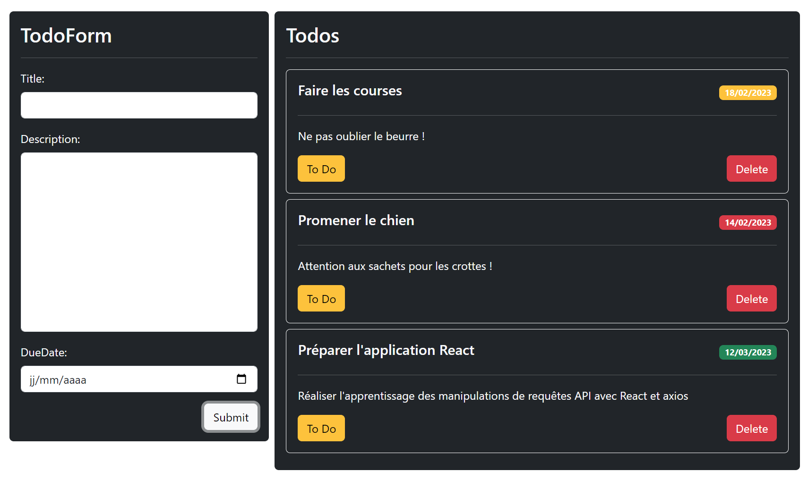

# Application TodoList en Typescript
### Objectif
Appréhender la manipulation de React et du state en se servant de la version Typescript de React

### Sujet
Réaliser une application front-end avec React permettant à un utilisateur de manipuler des tâches et de pouvoir les valider, ce qui aura pour effet de les supprimer de la liste de tâches. 

Vos tâches devront posséder comme propriétés leur nom, un descriptif, une date ainsi qu'un statut de complétion (finie ou non), avec par exemple la structure ci-dessous:

```tsx
class TodoItem {
  private static _count = 0;
  private _id: number;
  private _isDone: boolean;

  constructor(private title: string, private description: string, private dueDate: Date) {
    this._id = ++TodoItem._count;
    this._isDone = false;
  }
}
```

Vous devrez utiliser plusieurs composants React: 
- Un composant parent qui va permettre de centraliser les données des tâches. Ce composant aura pour rôle de réceptionner, depuis un composant enfant, l'envoi d'une nouvelle tâche et de l'ajouter à la liste des tâches. Il aura aussi pour rôle de réceptionné, depuis les composants représentant les tâches, les modification de statut ou une demande de suppression d'une tâche. Pour centraliser les tâches, vous devrez idéalement utiliser `useState()`
- Un composant de formulaire ayant pour rôle la création d'une tâche. Ce composant se servira idéalement de `useRef()` pour éviter des problèmes de gestion de performances de l'application. Il se servira des **props** pour informer le parent de l'ajout potentiel d'une tâche.
- Un ou plusieurs composants servant à l'affichage des tâches. Ce composant contiendra la capacité de voir les détails de la tâche mais également d'avoir des boutons pour provoquer chez le parent la demande de modification du statut d'une tâche (finie ou non) et / ou la suppression d'une tâche terminée. La demande de suppression d'une tâche non terminée demandera une confirmation chez l'utilisateur avant sa suppression réelle.

---


